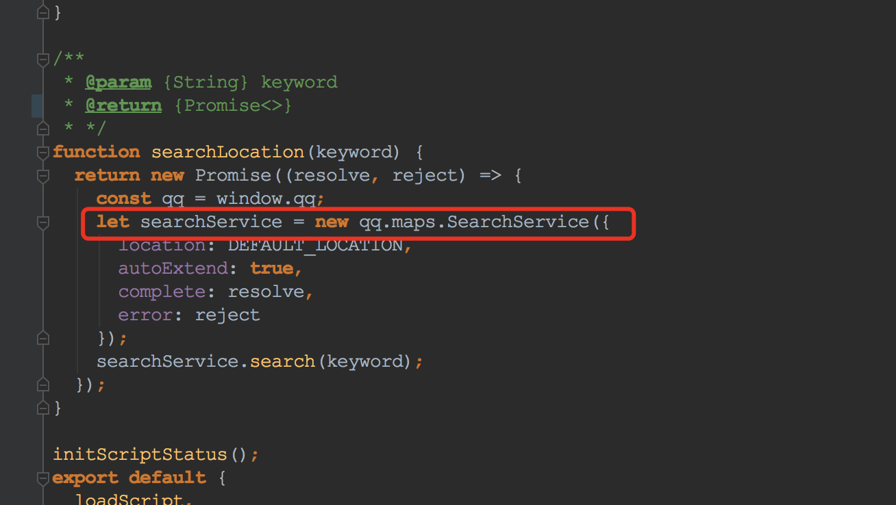
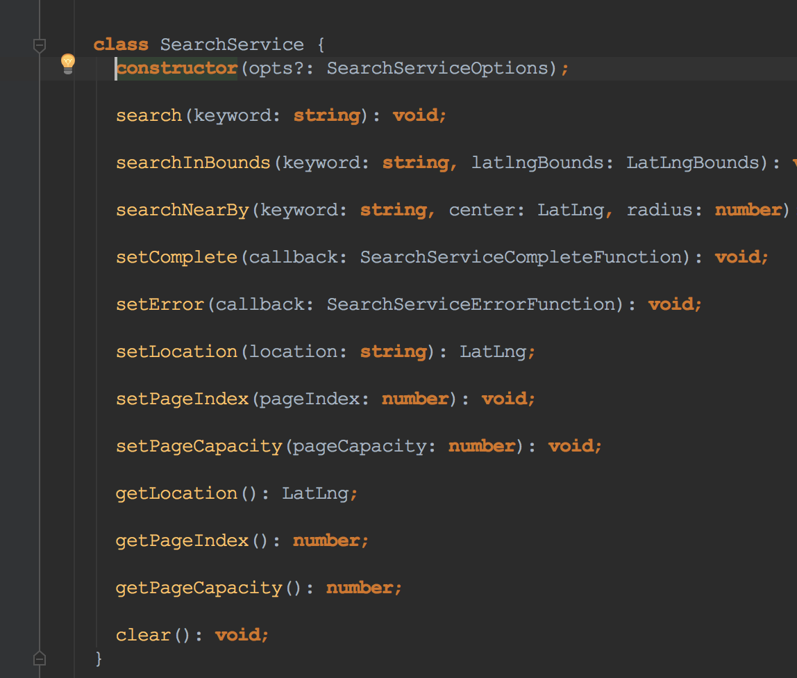

# Tencent Location JavaScript API V2 Type Definitions 

[](https://www.npmjs.com/package/lbs-tencent-typings)


## Background

This is an 的Type Definitions of  [QQMaps - JavaScript API](http://lbs.qq.com/javascript_v2/doc/) V2 .


## Road Map

- Provide Complete Type Definitions (100%)
- Provide Complete Type Definitions with Comments (0%)
- Pure API Example (50%)
- UI Framework Component Example
- Typing Tests

## Usage

### Installation
```bash
yarn add -D lbs-tencent-typings
```

### Screen Shot




## Advanced: ESLint Configuration

如果项目中使用了`eslint-loader` + 不允许未经定义的全局变量, 可以通过在引入修改这份typings之后, 修改你的ESLint配置.
具体改动为: 在ESLint配置文件(例如`.eslintrc`)中定义`globals`,在里面添加`qq`这个namespace

```json
{
  "globals": {
      "qq": true
    }
}

```

## Advanced: API Usage Examples

为此, 写了一个使用**create-react-app** + **antd** 的 autocomplete 组件快速发开的, 脚本加载API和地点搜索补全功能.

详见Demo页面: [LBS Tencent Typings Sample](https://blog.aquariuslt.com/lbs-tencent-typings-sample/)

样例Repository: [lbs-tencent-typings-sample](https://github.com/aquariuslt/lbs-tencent-typings-sample)


### Pure Promise API Example

### React Component with API

### Vue Component with API


